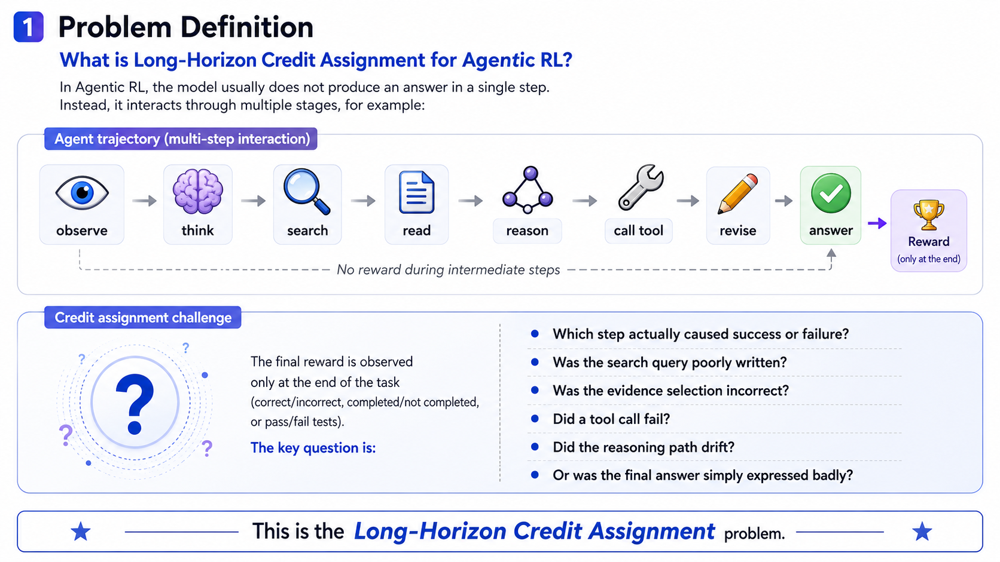

# Awesome-Long-Horizon-Credit-Assignment-for-Agentic-RL

A curated list of papers, benchmarks, methods, and resources for **Long-Horizon Credit Assignment in Agentic Reinforcement Learning**.

---

## 📢 News

- 🚀 2026-05-27: Repository initialized.
- 📝 2026-05-28: Taxonomy for long-horizon credit assignment released.

---

## 📚 Table of Contents

- [🏛️ Awesome-Long-Horizon-Credit-Assignment-for-Agentic-RL](#-awesome-long-horizon-credit-assignment-for-agentic-rl)
  - [📢 News](#-news)
  - [🧭 Taxonomy](#-taxonomy)
    - [1️⃣ Trajectory-level Credit Assignment](#1-trajectory-level-credit-assignment)
    - [2️⃣ Step-level and Turn-level Credit Assignment](#2-step-level-and-turn-level-credit-assignment)
    - [3️⃣ Branch-level and Tree-structured Credit Assignment](#3-branch-level-and-tree-structured-credit-assignment)
    - [4️⃣ Action-level and Tool-use Credit Assignment](#4-action-level-and-tool-use-credit-assignment)
    - [5️⃣ Retrieval and Evidence-level Credit Assignment](#5-retrieval-and-evidence-level-credit-assignment)
    - [6️⃣ Memory-level and Skill-level Credit Assignment](#6-memory-level-and-skill-level-credit-assignment)
    - [7️⃣ Advantage Estimation and Policy Optimization under Long Horizons](#7-advantage-estimation-and-policy-optimization-under-long-horizons)
    - [8️⃣ Benchmarks and Evaluation Protocols](#8-benchmarks-and-evaluation-protocols)
  - [📄 Papers](#-papers)
  - [🤝 Contributing](#-contributing)
  - [⭐ Star History](#-star-history)
  - [📑 Citation](#-citation)

---

## 🧭 Taxonomy

### 1️⃣ Trajectory-level Credit Assignment

Final-outcome rewards, sparse rewards, trajectory-level verification, and success/failure-based optimization.

### 2️⃣ Step-level and Turn-level Credit Assignment

Process rewards, step-level verifiers, dense feedback, intermediate supervision, and turn-level rewards.

### 3️⃣ Branch-level and Tree-structured Credit Assignment

Tree search, multi-path reasoning, branch-level rewards, node-level value estimation, and hierarchical advantage estimation.

### 4️⃣ Action-level and Tool-use Credit Assignment

Credit assignment for tool calls, code execution, API use, browser actions, and environment interactions.

### 5️⃣ Retrieval and Evidence-level Credit Assignment

Search agents, query-level rewards, document utility estimation, evidence-level feedback, and retrieval-augmented RL.

### 6️⃣ Memory-level and Skill-level Credit Assignment

Reusable skills, reflection memory, failure memory, option learning, hierarchical policies, and cross-trajectory credit assignment.

### 7️⃣ Advantage Estimation and Policy Optimization under Long Horizons

Long-horizon advantage estimation, variance reduction, entropy regularization, adaptive KL, reward normalization, and stable policy optimization.

### 8️⃣ Benchmarks and Evaluation Protocols

Benchmarks, environments, and evaluation protocols for long-horizon agentic RL and credit assignment.

---

## 📄 Papers

### 1️⃣ Trajectory-level Credit Assignment

| 📖 Title | 🛠 Model / Method | 📅 Date | 💻 Code | 🏛 Venue |
| :--- | :---: | :---: | :---: | :---: |
| [DeepSeek-R1: Incentivizing Reasoning Capability in LLMs via Reinforcement Learning](https://arxiv.org/abs/2402.03300) | GRPO | 2025 | [Code](https://github.com/deepseek-ai/deepseek-r1) | arXiv |
|[Understanding self-evolution in llm agents via multi-turn reinforcement learning](https://arxiv.org/pdf/2504.20073)|Ragen|2025|[Code](https://github.com/RAGEN-AI/RAGEN)|arxiv|
| [Latent Reward: LLM-Empowered Credit Assignment in Episodic Reinforcement Learning](https://ojs.aaai.org/index.php/AAAI/article/view/34213) | Latent Reward / LaRe | 2025 | [Code](https://github.com/thu-rllab/LaRe) | AAAI |

### 2️⃣ Step-level and Turn-level Credit Assignment

| 📖 Title | 🛠 Model / Method | 📅 Date | 💻 Code | 🏛 Venue |
| :--- | :---: | :---: | :---: | :---: |
| [StepPO: Step-Aligned Policy Optimization for Agentic Reinforcement Learning](https://arxiv.org/abs/2604.18401) | StepPO / Step-level Policy Optimization | 2026 | [Code](https://github.com/AgentR1/StepPO) | arXiv |
| [Turn-level advantage estimation with ppo for improved multi-turn rl in agentic llms](https://aclanthology.org/2026.findings-eacl.328.pdf) | Turn-ppo | 2026 | - | Findings of EACL |
|[Step-level advantage assignment for long-horizon agents via trajectory graph](https://aclanthology.org/2026.findings-eacl.247.pdf)|Salt|2026|-|Findings of EACL|
| [Stop Summation: Min-Form Credit Assignment Is All Process Reward Model Needs for Reasoning](https://papers.nips.cc/paper_files/paper/2025/hash/be91eb86eb74efc055cff83e953f86ce-Abstract-Conference.html) | PURE / Min-form PRM | 2025 | [Code](https://github.com/CJReinforce/PURE) | NeurIPS |
| [SSVPO: Effective Step-Level Credit Assignment for RL Training of Language Models](https://openreview.net/forum?id=g33DGvnHYd) | SSVPO / Sequential Shapley Value | 2026 | - | ICLR |
| [SWEET-RL: Training Multi-Turn LLM Agents on Collaborative Reasoning Tasks](https://arxiv.org/abs/2503.15478) | SWEET-RL / Privileged Critic | 2025 | [Code](https://github.com/facebookresearch/sweet_rl) | arXiv |
|[T2PO: Uncertainty-Guided Exploration Control for Stable Multi-Turn Agentic Reinforcement Learning](https://arxiv.org/pdf/2605.02178)|T2PO|2026|[Code](https://github.com/WillDreamer/T2PO)|ICML(Spotlight)|
| [Hindsight Credit Assignment for Long-Horizon LLM Agents](https://arxiv.org/pdf/2603.08754) | HCAPO / Hindsight Credit Assignment | 2026 | - | arXiv |
| [Agentic Reinforcement Learning with Implicit Step Rewards](https://openreview.net/forum?id=ooROvpmxMV) | iStar / Implicit Step Rewards | 2026 | - | ICLR |

### 3️⃣ Branch-level and Tree-structured Credit Assignment

| 📖 Title | 🛠 Model / Method | 📅 Date | 💻 Code | 🏛 Venue |
| :--- | :---: | :---: | :---: | :---: |
| [Tree search for llm agent reinforcement learning](https://arxiv.org/pdf/2509.21240) | Tree-GRPO | 2026 | [Code](https://github.com/AMAP-ML/Tree-GRPO) | ICLR |
|[Tree-structured reinforcement fine-tuning for self-evolving embodied agents](https://proceedings.neurips.cc/paper_files/paper/2025/file/7103cd82de95a7b30983fcf74ba499ac-Paper-Conference.pdf)|SEEA-R1|2026|[Code](https://seea-r1.github.io/)|NeurIPS|
| [Segment Policy Optimization: Effective Segment-Level Credit Assignment in RL for Large Language Models](https://arxiv.org/abs/2505.23564) | SPO / SPO-tree | 2025 | [Code](https://github.com/AIFrameResearch/SPO) | NeurIPS |
| [TreeRPO: Tree Relative Policy Optimization](https://arxiv.org/abs/2506.05183) | TreeRPO | 2025 | [Code](https://github.com/yangzhch6/TreeRPO) | arXiv |
| [Exploiting Tree Structure for Credit Assignment in RL Training of LLMs](https://arxiv.org/abs/2509.18314) | TEMPO / Prefix-to-Tree | 2025| -|arXiv |
|[AT2PO: Agentic Turn-based Policy Optimization via Tree Search](https://arxiv.org/abs/2601.04767)|AT2PO|2026|[Code](https://github.com/zzfoutofspace/ATPO)|arXiv|

### 4️⃣ Action-level and Tool-use Credit Assignment

| 📖 Title | 🛠 Model / Method | 📅 Date | 💻 Code | 🏛 Venue |
| :--- | :---: | :---: | :---: | :---: |
| [Agent Lightning: Train ANY AI Agents with Reinforcement Learning](https://arxiv.org/abs/2508.03680) | Agent Lightning | 2025 | [Code](https://github.com/microsoft/agent-lightning) | arXiv |
| [CARL: Criticality-Aware Agentic Reinforcement Learning](https://arxiv.org/abs/2512.04949) | CARL | 2025 | - | arXiv |
| [SPA-RL: Reinforcing LLM Agents via Stepwise Progress Attribution](https://arxiv.org/abs/2505.20732) | SPA-RL | 2025 | [Code](https://github.com/WangHanLinHenry/SPA-RL-Agent) | arXiv |

### 5️⃣ Retrieval and Evidence-level Credit Assignment

| 📖 Title | 🛠 Model / Method | 📅 Date | 💻 Code | 🏛 Venue |
| :--- | :---: | :---: | :---: | :---: |
| [Expanding Exploration for LLM Agents via Retrieval-Augmented Policy Optimization](https://arxiv.org/pdf/2603.03078)|RAPO|2026|-|KDD|
| [CriticSearch: Fine-Grained Credit Assignment for Search Agents via a Retrospective Critic](https://arxiv.org/abs/2511.12159) | CriticSearch | 2025 | - | arXiv |
| [Information Gain-based Policy Optimization: A Simple and Effective Approach for Multi-Turn Search Agents](https://openreview.net/forum?id=qkWP6phrvZ) | IGPO | 2026 | [Code](https://github.com/GuoqingWang1/IGPO) | ICLR |
| [Evidence-Augmented Policy Optimization with Reward Co-Evolution for Long-Context Reasoning](https://arxiv.org/abs/2601.10306) | EAPO | 2026 | - | arXiv |
| [Reinforced Informativeness Optimization for Long-Form Retrieval-Augmented Generation](https://arxiv.org/abs/2505.20825) | RioRAG | 2025 | [Code](https://github.com/RUCAIBox/RioRAG) | arXiv |

### 6️⃣ Memory-level and Skill-level Credit Assignment

| 📖 Title | 🛠 Model / Method | 📅 Date | 💻 Code | 🏛 Venue |
| :--- | :---: | :---: | :---: | :---: |
| [Memory-T1: Reinforcement Learning for Temporal Reasoning in Multi-session Agents](https://arxiv.org/abs/2512.20092) | Memory-T1 | 2025 | [Code](https://github.com/Elvin-Yiming-Du/Memory-T1) | arXiv / OpenReview |
| [Memory-R2: Fair Credit Assignment for Long-Horizon Memory-Augmented LLM Agents](https://arxiv.org/html/2605.21768v1) | Memory-R2 / LoGo-GRPO | 2026 | - | arXiv |
| [SCRIBE: Structured Mid-Level Supervision for Tool-Using Language Models](https://arxiv.org/abs/2601.03555) | SCRIBE / Skill Prototype | 2026 | - | arXiv |
| [CODESKILL: Learning Self-Evolving Skills for Coding Agents](https://arxiv.org/abs/2605.25430) | CODESKILL | 2026 | - | arXiv |

### 7️⃣ Advantage Estimation and Policy Optimization under Long Horizons

| 📖 Title | 🛠 Model / Method | 📅 Date | 💻 Code | 🏛 Venue |
| :--- | :---: | :---: | :---: | :---: |
| [Group-in-Group Policy Optimization for LLM Agent Training](https://proceedings.neurips.cc/paper_files/paper/2025/file/420c9f777c0b4f78d515e53cf74d58b2-Paper-Conference.pdf) | GIGPO | 2025 | [Code](https://github.com/langfengQ/verl-agent) | NeurIPS |
| [Adaptive tree policy optimization for multi-turn medical dialogue](https://arxiv.org/pdf/2603.02216)|ATPO|2026|-|ICLR|
|[Tree-Structured Advantage Redistribution for Group-Based RL](https://arxiv.org/abs/2601.03703)|TreeAdv|2026|-|arxiv|
|[End-to-end policy optimization for gui agents with experience replay](https://arxiv.org/pdf/2505.16282?)|Arpo|2025|-|arxiv|
|[Agentic reinforced policy optimization](https://arxiv.org/pdf/2507.19849)|ARPO|2025|-|arxiv|
|[Agentic entropy-balanced policy optimization](https://arxiv.org/pdf/2510.14545)|AEPO|2025|-|arxiv|
|[Information Gain-based Policy Optimization: A Simple and Effective Approach for Multi-Turn LLM Agents](https://arxiv.org/pdf/2510.14967?)|IGPO|2026|[Code](https://github.com/GuoqingWang1/IGPO)|ICLR|
|[Meta-RL Induces Exploration in Language Agents](https://arxiv.org/pdf/2512.16848)|LaMer|2026|-|ICLR|
| [Stabilizing Off-Policy Training for Long-Horizon LLM Agent via Turn-Level Importance Sampling and Clipping-Triggered Normalization](https://arxiv.org/abs/2511.20718) | SORL / SO-PPO / SO-GRPO | 2025 | - | arXiv |
| [Your Group-Relative Advantage Is Biased](https://arxiv.org/abs/2601.08521) | HA-DW / GRPO Bias Analysis | 2026 | - | arXiv |
| [VinePPO: Refining Credit Assignment in RL Training of LLMs](https://proceedings.mlr.press/v267/kazemnejad25a.html) | VinePPO | 2025 | [Code](https://github.com/McGill-NLP/VinePPO) | ICML |

### 8️⃣ Benchmarks and Evaluation Protocols

| 📖 Title | 🛠 Benchmark / Environment | 📅 Date | 💻 Code | 🏛 Venue |
| :--- | :---: | :---: | :---: | :---: |
| [SWEET-RL: Training Multi-Turn LLM Agents on Collaborative Reasoning Tasks](https://arxiv.org/abs/2503.15478) | ColBench | 2025 | [Code](https://github.com/facebookresearch/sweet_rl) | arXiv |
| [MemGym: a Long-Horizon Memory Environment for LLM Agents](https://arxiv.org/abs/2605.20833) | MemGym | 2026 | - | arXiv |
| [From Reasoning to Agentic: Credit Assignment in Reinforcement Learning for Large Language Models](https://arxiv.org/abs/2604.09459) | Credit Assignment Survey / Protocol | 2026 | - | arXiv |
| [Measuring AI Ability to Complete Long Tasks](https://arxiv.org/html/2503.14499v2) | Long Task Evaluation / Task Horizon | 2025 | [Code](https://github.com/METR/eval-analysis-public) | arXiv / METR |

---

## 🤝 Contributing

- Add missing papers, benchmarks, or code repositories.
- Correct metadata, links, venues, or dates.
- Suggest better taxonomy improvements.
- Open issues for discussion.

---

## ⭐ Star History

}
